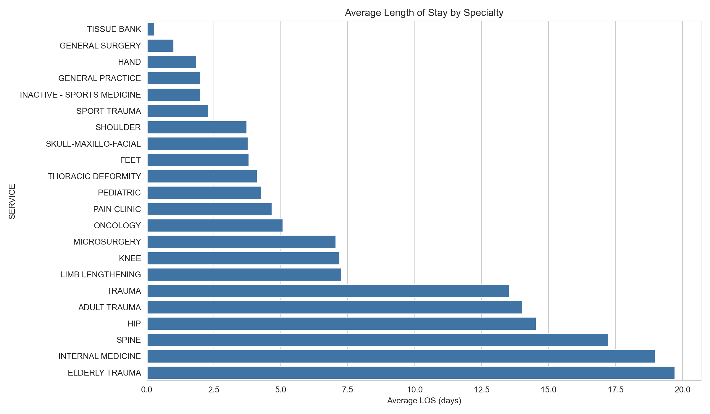
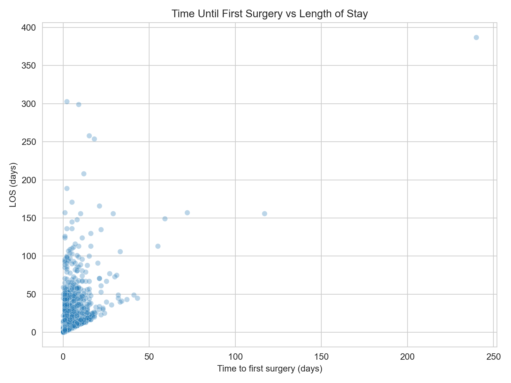
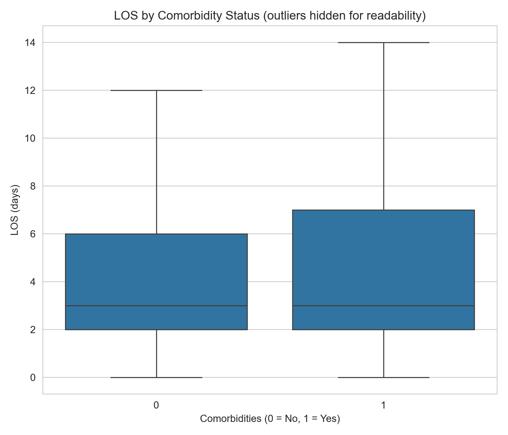
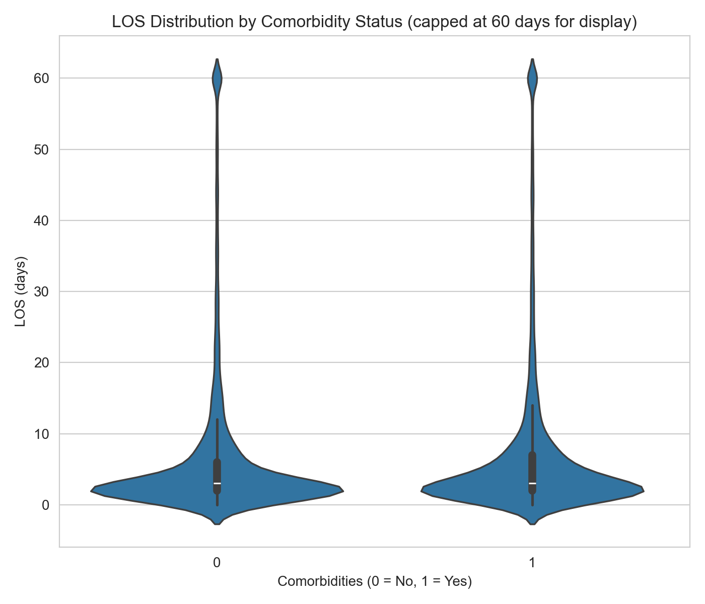
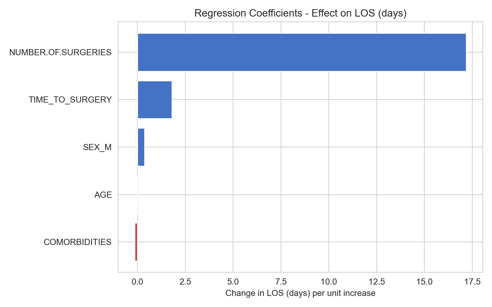
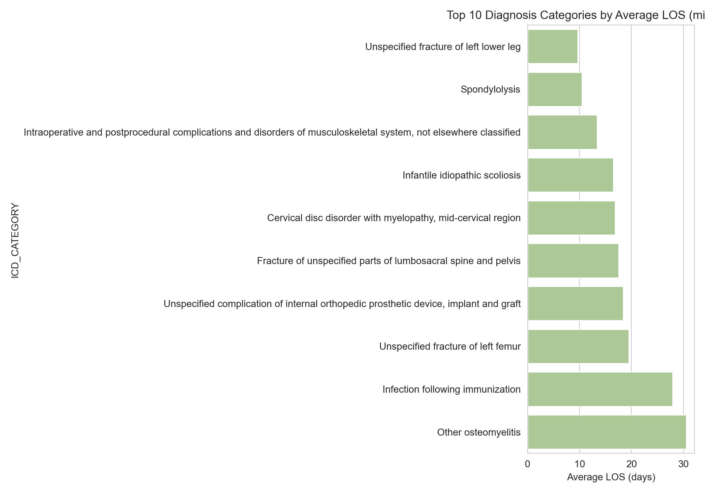
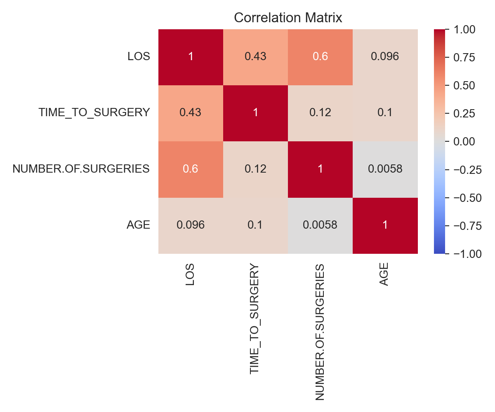

# Orthopaedic Length of Stay Analysis & Discharge Planning Insights

A statistical analysis of 79,000+ real orthopaedic hospital admissions, built to identify the operational drivers of Length of Stay (LOS) and support bed-capacity, surgical-scheduling, and discharge-planning decisions.

## 📌 Overview

Length of Stay is one of the biggest levers a hospital manager has over bed capacity, patient flow, and cost, but it's driven by a mix of clinical and operational factors that aren't obvious from raw admission data. This project analyses 79,485 orthopaedic admission records to answer a practical question:

**Which factors actually extend a patient's stay, and which of those are things a hospital can act on?**

The analysis combines descriptive statistics, hypothesis testing, correlation analysis, and multiple linear regression to separate the controllable drivers (surgical scheduling, discharge pathways) from the fixed ones (age, specialty mix), so operational effort goes where it has the most impact.

## 🎯 Key Question

**Can LOS variation be explained well enough by operational + clinical factors to guide bed-capacity and discharge planning?**

Yes: a five-factor regression model (surgical delay, number of surgeries, comorbidities, age, sex) explains **57.7% of LOS variance** (R² = 0.577, n = 69,499), with two factors, time to surgery and number of surgeries, accounting for the overwhelming majority of that explanatory power.

## 📊 Exploratory Data Analysis

### 🏥 Average LOS by Specialty

Elderly Trauma, Internal Medicine, and Spine consistently run the longest average stays, the three clearest targets for LOS-reduction initiatives.



### 🔬 Time to First Surgery vs. LOS

Each additional day before surgery is associated with roughly **1.8 extra days** of stay, one of the two strongest, and most directly actionable, drivers in the dataset.



### ⚖️ LOS by Comorbidity Status

Comorbid patients stay measurably longer, but the effect is small next to surgical factors: real, but not where capacity-planning effort should concentrate.




### 📈 Regression Coefficients: Effect on LOS

Number of surgeries dwarfs every other factor in the model; time to surgery is a distant second; age, sex, and comorbidities are minor by comparison.



### 🩻 Top Diagnosis Categories by LOS

Osteomyelitis (bone infection) and post-immunization infection carry the highest average LOS of any diagnosis category with meaningful case volume.



### 🧮 Correlation Matrix



## 📊 Data Source

- Real orthopaedic hospital admission records, 79,485 rows × 20 columns, spanning 2012-2021
- Supplemented with an ICD-10 lookup table (71,704 codes) to map diagnosis codes to readable categories
- **Raw data is not included in this repository**: the source dataset contains internal hospital record/protocol numbers that are pseudonymous but not fully anonymous, so it's excluded here for privacy. The full column schema is documented in [`data/README.md`](data/README.md) so the pipeline is reproducible against any dataset with a matching structure.
- ✅ No patient names, dates of birth, or addresses are present in the dataset at any point in this analysis
- Aggregate-only summary tables (no row-level data, no identifiers) are available in [`outputs/summary_tables/`](outputs/summary_tables/) for anyone who wants the underlying numbers without the raw data

## 🔬 Statistical Methods & Tools

| Method | Purpose |
|---|---|
| Data cleaning (row-wise date parsing) | Fixed a silent bug that had been dropping ~40% of records |
| Descriptive statistics (group means, std, median) | LOS profiling by specialty, diagnosis, discharge type |
| Welch's t-test | Tested whether comorbidities significantly affect LOS |
| Pearson correlation | Quantified strength of association for age, surgery count, surgical delay |
| Multiple linear regression (OLS) | Isolated the independent effect of each factor, holding others constant |

**Tools:** Python · pandas · NumPy · statsmodels · SciPy · seaborn · matplotlib

## 🐛 Data Quality Finding Worth Calling Out

The original version of this analysis fed the `ADMISSION.DATE` / `DISCHARGE.DATE` / `FIRST.SURGERY.DATE` columns straight into `pd.to_datetime()` in one call. Pandas infers a single date format from the column and silently converts every non-matching row to `NaT`, with no error and no warning. This dataset mixes two date formats, so ~40% of records silently lost their LOS value, which cut the usable dataset roughly in half and flipped one conclusion (comorbidities looked statistically insignificant at p = 0.177; with the full data recovered, p = 0.0034, a real if small effect). Parsing dates row by row recovers 99.9% of records (79,426 of 79,485) and is the approach used throughout this analysis.

## 📊 Key Findings

- 🏆 **Number of surgeries is the single strongest driver of LOS** (r = 0.60): each additional surgery adds ~17 days on average, holding other factors constant
- ⏱️ **Time to first surgery** is the second-strongest and most directly actionable driver (r = 0.43): each day of delay adds ~1.8 days to the stay
- 🏥 **Elderly Trauma, Internal Medicine, and Spine** have the highest average LOS (19.7, 19.0, and 17.2 days respectively)
- ⚖️ **Comorbidities** have a small but statistically significant effect (+0.39 days, p = 0.0034): real, but secondary to surgical factors
- 📈 **Age** has only a weak effect (r = 0.10, ~0.05 extra days per year)
- 🔁 **Transferred patients** stay more than twice as long on average (14.7 vs 6.9 days)
- ⚠️ **Death and transfer discharges** carry the highest average LOS by far (55.0 and 35.2 days vs 7.4 for routine discharges)
- 🦠 **Osteomyelitis and post-immunization infection** are the two highest-LOS diagnosis categories among those with sufficient case volume (≥200 cases)

## 🔎 Recommendations for Operations

1. **Prioritise surgical scheduling**: surgical delay is the biggest *actionable* LOS driver; cutting pre-op wait time has a clear, quantified payoff
2. **Build dedicated pathways for multi-surgery patients**: flag them early for discharge planning given their outsized effect on LOS
3. **Target Elderly Trauma, Internal Medicine, and Spine** specifically for LOS-reduction initiatives
4. **Treat comorbidities as real but secondary**: not worth over-indexing resource planning on
5. **Run a dedicated infection-management review** for osteomyelitis and post-immunization infection cases
6. **Build a discharge-destination risk flag**: transfer and death-related discharges run 3-7x the average LOS; early identification helps bed-capacity forecasting

## 🚀 Getting Started

### Installation

```bash
pip install -r requirements.txt
```

### Data

This repo doesn't ship the raw CSVs (see [Data Source](#-data-source)). To run the pipeline, place two files matching the schema in [`data/README.md`](data/README.md) into `data/`:
- `hospital_data.csv`
- `icd_codes.csv`

### Run the Pipeline

```bash
cd src
python analysis.py
```

This will:
- Clean and merge the admission + ICD lookup data
- Run descriptive stats, t-test, correlation, and regression analysis
- Print all findings to the console
- Save 7 charts to `outputs/`

## 📂 Repo Structure

```
orthopedic-hospital-los-analysis/
├── data/
│   └── README.md          # column schema / data dictionary (raw CSVs not included)
├── src/
│   └── analysis.py         # full pipeline: clean -> describe -> test -> model -> chart
├── outputs/                 # 7 charts generated by analysis.py
├── docs/
│   └── README.md
├── requirements.txt
└── README.md
```

## 🛠️ Skills Demonstrated

- **Statistical analysis**: hypothesis testing (Welch's t-test), correlation analysis, multiple linear regression (OLS)
- **Data cleaning & validation**: diagnosed and fixed a silent date-parsing bug that had invalidated ~40% of records
- **Healthcare analytics**: LOS modelling, diagnosis (ICD-10) categorisation, discharge-pathway analysis
- **Business framing**: translating statistical output into operational recommendations (bed capacity, surgical scheduling, discharge planning)
- **Data visualisation**: seaborn/matplotlib charts designed for a non-technical, operational audience
- **Reproducible pipelines**: a single script that takes raw data to cleaned dataset to statistical models to charts

## ⚠️ Limitations

- LOS has a long right tail (max 1,215 days); box/violin plots cap the display range for readability, but all statistics use the full uncapped data
- `HOSPITALIZATION.TYPE` is missing for ~33% of records and wasn't used as a predictor for that reason
- `TIME.BETWEEN.INJURY.AND.HOSPITALIZATION` is 100% empty and was dropped entirely
- ICD matching uses the 3-character diagnosis prefix (92% match rate) rather than the full code (22% match rate), since the lookup table's 7th-character extensions aren't used in this dataset
- This is an observational dataset: regression coefficients describe association, not causation

## 📝 Disclaimer

This analysis uses de-identified orthopaedic hospital admission data. No patient names, dates of birth, or addresses are present in this repository at any point. Raw data files are intentionally excluded; see [Data Source](#-data-source).
